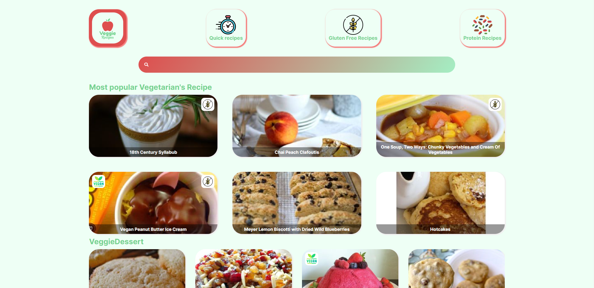

## Vegetarian Recipe App

<!-- TABLE OF CONTENTS -->

  
Table of Contents

  <ol>
    <li>
      <a href="#about-the-project">About The Project</a>
      <ul>
        <li><a href="#built-with">Built With</a></li>
      </ul>
    </li>
    <li><a href="#contact">Contact</a></li>
  </ol>

<!-- ABOUT THE PROJECT -->
## About The Project
Vegetarian recipe site where you can search for new recipes and experiment with new dishes. Enjoy!

(<a href="#top">back to top</a>)

### Built With
* [React](https://it.reactjs.org/)
* [JavaScript](https://www.javascript.com/)
* [Axios](https://axios-http.com/)
* [React-Router](https://reactrouter.com/)

(<a href="#top">back to top</a>)

<!-- CONTACT -->
## Contact

Rosario Luca Linguanti - rosariolinguanti37@outlook.it

(<a href="#top">back to top</a>)

